# Anthony James Padavano

**Creative Technologist / Systems Architect**

I build autonomous creative systems and treat their governance as an artistic medium — shipping infrastructure that coordinates theory, generative art, commerce, and community as a single governed system.

**Now:** Shipping an [eight-organ orchestration system](https://github.com/meta-organvm) across <!-- v:total_repos -->148<!-- /v --> repos, <!-- v:total_organs -->10<!-- /v --> orgs, and <!-- v:total_words_short -->6K+<!-- /v --> words of public documentation.

[Portfolio](https://4444j99.github.io/portfolio/) · [Resume](https://4444j99.github.io/portfolio/resume/) · [Email](mailto:padavano.anthony@gmail.com)

---

### Flagship Systems

<table>
<tr>
<td width="50%">

**[Recursive Engine (RE:GE)](https://github.com/organvm-i-theoria/recursive-engine--generative-entity)**
Symbolic operating system for myth, identity, and recursive structures — 1,254 tests, 85% coverage, 21 organ handlers.

</td>
<td width="50%">

**[Agentic Titan](https://github.com/organvm-iv-taxis/agentic-titan)**
Polymorphic agent swarm architecture — 1,095+ tests, 6 self-organizing topologies, 22 agent archetypes, 18 phases.

</td>
</tr>
<tr>
<td width="50%">

**[Metasystem Master](https://github.com/organvm-ii-poiesis/metasystem-master)**
Generative art architecture — real-time audiovisual systems treating performance infrastructure as creative medium.

</td>
<td width="50%">

**[Orchestration Start Here](https://github.com/organvm-iv-taxis/orchestration-start-here)**
Governance-as-code — machine-readable registry, dependency validation, promotion state machines, 5 CI/CD workflows.

</td>
</tr>
<tr>
<td width="50%">

**[Commerce Meta](https://github.com/organvm-iii-ergon/commerce--meta)** · *ergon*
Commerce substrate — the hub for deployed products and revenue infrastructure across the ergon organ.

</td>
<td width="50%">

**[Community Hub](https://github.com/organvm-vi-koinonia/community-hub)** · *koinonia*
Collaborative infrastructure — salons, reading groups, and shared spaces coordinating the koinonia organ.

</td>
</tr>
<tr>
<td width="50%">

**[Kerygma Pipeline](https://github.com/organvm-vii-kerygma/kerygma-pipeline)** · *kerygma*
Distribution pipeline — amplification and audience delivery for work surfaced from the other organs.

</td>
<td width="50%">

**[Public Process](https://github.com/organvm-v-logos/public-process)** · *logos*
Building in public — the essay and editorial pipeline feeding the logos organ (see *Latest Essays* below).

</td>
</tr>
</table>

---

### Stack

**Languages** &ensp;


**Frameworks** &ensp;


**AI / ML** &ensp;


**Infrastructure** &ensp;


**Creative** &ensp;


---

### The Eight-Organ System

```
I   theoria   ·  ontology, recursion, epistemic engines
II  poiesis   ·  generative art, performance, experiential systems
III ergon     ·  products, platforms, deployed commerce
IV  taxis     ·  orchestration, governance, agent swarms
V   logos     ·  essays, public process, building in public
VI  koinonia  ·  community, salons, collaborative infrastructure
VII kerygma   ·  distribution, amplification, audience
    meta      ·  the system that holds the system
```

Each organ is a [GitHub organization](https://github.com/meta-organvm). The meta-system — the governance layer, the registry, the dependency graph — is itself the primary artifact. Read the [essays on building in public](https://organvm-v-logos.github.io/public-process/).

---

### GitHub Stats

<a href="https://github.com/4444j99">
  
  
</a>

### Streak

<a href="https://github.com/4444j99">
  
</a>

### Trophies

<a href="https://github.com/4444j99">
  
</a>

### Contribution Graph

<picture>
  <source media="(prefers-color-scheme: dark)" srcset="./assets/snake-dark.svg" />
  <source media="(prefers-color-scheme: light)" srcset="./assets/snake.svg" />
  
</picture>

<details>
<summary>Detailed Metrics</summary>
<br />
<picture>
  <source media="(prefers-color-scheme: dark)" srcset="./assets/metrics-dark.svg" />
  <source media="(prefers-color-scheme: light)" srcset="./assets/metrics.svg" />
  
</picture>
</details>

---

### Latest Essays

<!-- BLOG-POST-LIST:START -->- [How a Governance System Taught an Agent Framework to Version Itself](https://organvm-v-logos.github.io/public-process/essays/how-governance-taught-agents-to-version/)- [The Organ Chain Reset: When the Pipeline Is the Product](https://organvm-v-logos.github.io/public-process/essays/the-organ-chain-reset/)- [The Autonomous Sprint: When the System Maintains Itself](https://organvm-v-logos.github.io/public-process/essays/the-autonomous-sprint/)- [Precision Over Volume: A Doctoral Thesis on Career Pipeline Optimization](https://organvm-v-logos.github.io/public-process/essays/precision-over-volume-doctoral-thesis/)- [Two Weeks and Forty-Six Essays: The ORGAN-V Production Retrospective](https://organvm-v-logos.github.io/public-process/essays/two-weeks-and-forty-six-essays/)<!-- BLOG-POST-LIST:END -->

---

### Background

MFA in Creative Writing (FAU) · BA in English Literature (CUNY) · Meta Full-Stack Developer · Google UX Design, Digital Marketing & Project Management · 10+ years across multimedia production, digital marketing, systems design, and higher education.

---

<sub>New York City · [Portfolio](https://4444j99.github.io/portfolio/) · [Resume](https://4444j99.github.io/portfolio/resume/) · [padavano.anthony@gmail.com](mailto:padavano.anthony@gmail.com) · [meta-organvm](https://github.com/meta-organvm)</sub>


<!-- SYSTEM-NAV-START -->

---

<sub>[Portfolio](https://4444j99.github.io/portfolio/) · [System Directory](https://4444j99.github.io/portfolio/directory/) · [ORGAN 4444J99](https://4444j99.github.io/) · Part of the <a href="https://4444j99.github.io/portfolio/directory/">ORGANVM eight-organ system</a></sub>

<!-- SYSTEM-NAV-END -->
